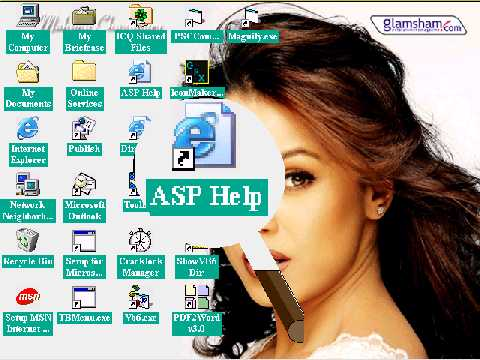



## Magnifying Lense

### Description

Move on the Screen and Magnify any part of the Window Screen of any application with a Magnifying Lense
 
### More Info
 

             |
---                |---
**Submitted On**   |2007-06-12 02:26:02
**By**             |[Waguih Youssef Sami](https://github.com/Planet-Source-Code/PSCIndex/blob/master/ByAuthor/waguih-youssef-sami.md)
**Level**          |Advanced
**User Rating**    |5.0 (10 globes from 2 users)
**Compatibility**  |VB 5\.0, VB 6\.0
**Category**       |[Complete Applications](https://github.com/Planet-Source-Code/PSCIndex/blob/master/ByCategory/complete-applications__1-27.md)
**World**          |[Visual Basic](https://github.com/Planet-Source-Code/PSCIndex/blob/master/ByWorld/visual-basic.md)
**Archive File**   |[Magnifying2070436122007\.zip](https://github.com/Planet-Source-Code/waguih-youssef-sami-magnifying-lense__1-68792/archive/master.zip)

